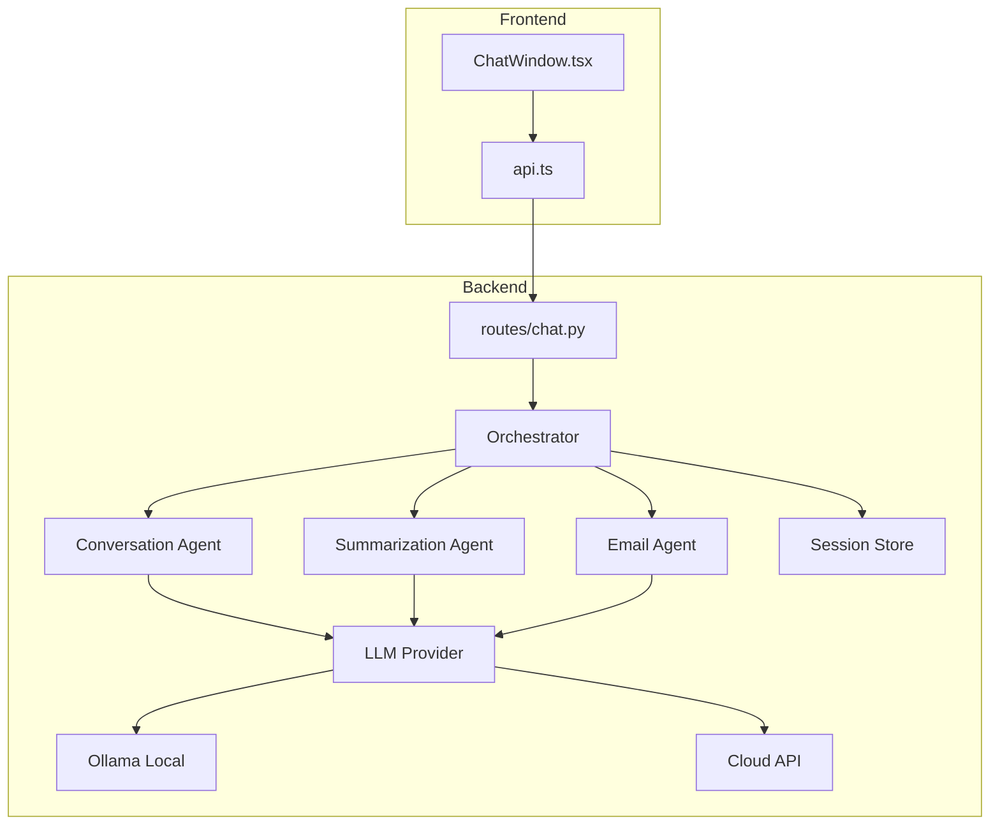

## Running the Full Application

### Start Backend
```bash
cd backend
.\venv\Scripts\activate
python main.py
# API: http://localhost:8000
# Docs: http://localhost:8000/docs
```

### Start Frontend
```bash
cd frontend
npm run dev
# App: http://localhost:5173
```

### LLM Provider Options

> [!IMPORTANT]
> The app requires an LLM provider. Choose one:

**Option A — Ollama (local, free):**
```bash
ollama serve                    # Start Ollama
ollama pull llama3.2            # Pull a model
# Set LLM_PROVIDER=ollama in backend/.env
```

**Option B — Cloud (OpenAI-compatible):**
```env
# In backend/.env:
LLM_PROVIDER=cloud
CLOUD_API_KEY=sk-your-api-key
CLOUD_BASE_URL=https://api.openai.com/v1
CLOUD_MODEL=gpt-4o-mini
```

---

## Architecture Diagram



---

## Test Results

```
Backend Agent Tests: 8/8 passing ✅
Frontend TypeScript: 0 errors ✅
Frontend Build: Success (197 KB JS, 9.5 KB CSS) ✅
Backend Import Check: All modules OK ✅
```
